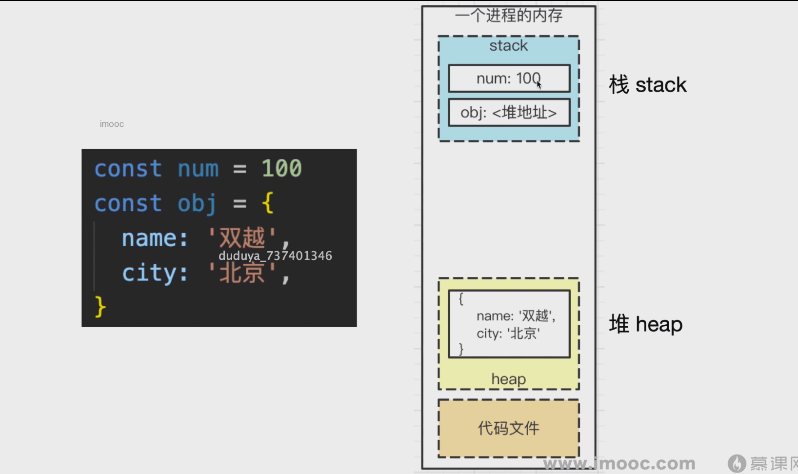
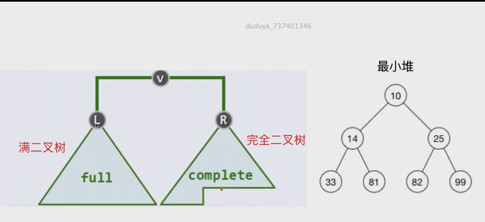
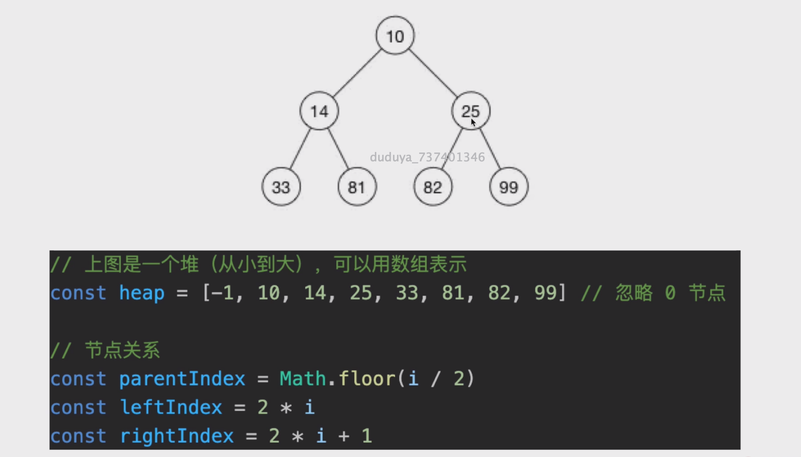

# 堆栈模型
- JS 代码执行时
- 值类型变量，存储在栈
- 引用类型变量，存储在堆

## 堆

- 完全二叉树（左侧先填满）
- 最大堆：父节点 >= 子节点
- 最小堆：父节点 <= 子节点

## 逻辑结构 VS 物理结构

- 堆，逻辑结构是一颗二叉树
- 但它物理结构是一个数组
- 数组：适合连续存储 + 节省空间

## 堆 VS BST

- 查询比 BST 慢
- 删除比 BST 快，维持平衡更快
- 但整体的时间复杂度都在 O(logn) 级别，即树的高度
## 堆的使用场景

- 特别适合“堆栈模型”
- 堆的数据，都是在栈中引用的，不需要从 root 遍历
- 堆恰巧是数组的形式，根据栈的地址，可用 O(1) 找到目标

