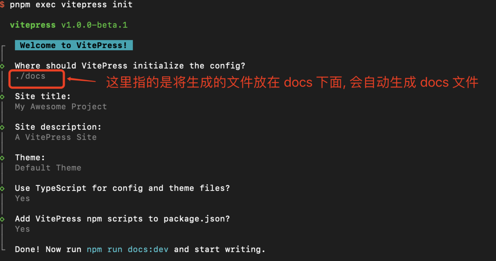
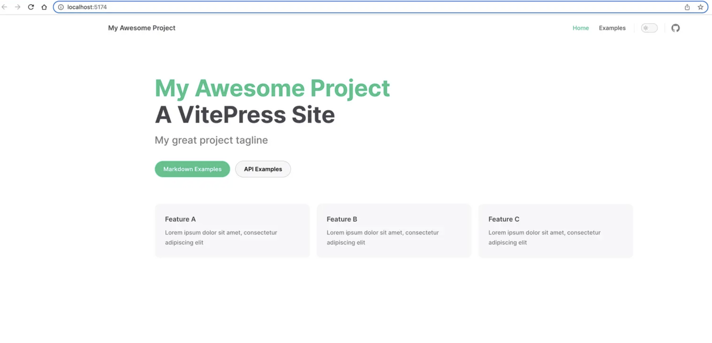
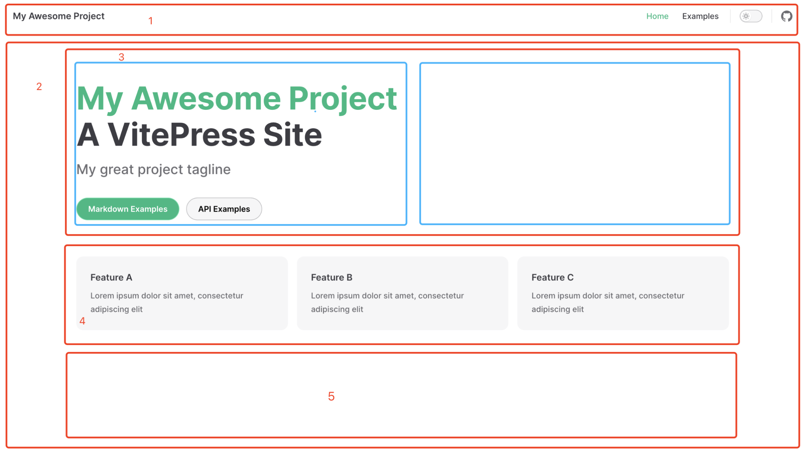
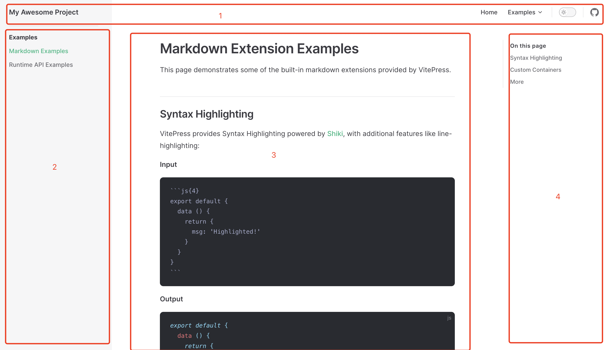
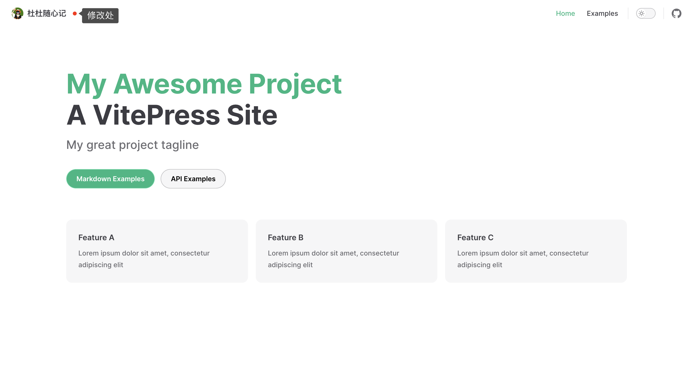
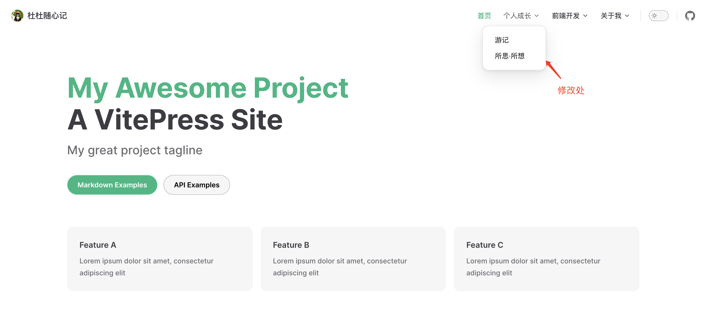

# 快速建站
带你**从0到1**用vitepress搭建一个个人博客，从初始化到项目部署。一起来看看~🕵️

## 一、项目配置
### 1.1 目标

- 自定义首页样式
- 拥有一个可自定义的侧导
- 高度自定义化一个专属个人的博客
### 1.2 搭建
首先创建并进入一个新目录：
```bash
mkdir vitepress-dudulab
cd vitepress-dudulab
```
接着，使用你喜欢的包管理器进行初始化。这里我用 pnpm，如下代码所示：
```bash
pnpm init
```
项目初始化完成以后，使用 pnpm 将 vitepress 安装为本地依赖。如下代码所示：
```bash
pnpm add vitepress -D
```
在 vitepress 官方文档中提到，vitepress附带了一个命令行向导，来帮助我们构建一个基本的项目。通过以下命令来执行该操作：
```bash
pnpm exec vitepress init
```
构建完成如下图所示：

此时文件的目录结构是这样的，如下树状代码所示：
```bash
├─ docs
│  ├─ .vitepress
│  │  └─ config.js
│  ├─ api-examples.md
│  ├─ markdown-examples.md
│  └─ index.md 入口文件
└─ package.json

```
到这里，我们就基本完成了 vitepress 项目的初始化。最后，我们运行  pnpm run docs:dev  来打开项目。效果如下:

## 二、美化布局
基础框架我们已经搭建完成，但看着博客的整体内容还比较少。接下来我们需要对博客进行进一步美化。
### 2.1 布局
首先，我们需要了解下博客的整体布局，才能更好的做美化。
#### 1、首页
对于vitepress来说，刚进去的那一刻，映入眼帘的就是**首页**，也就是docs/index.md这个文件。首页主要由以下五个部分组成：

对于首页来说，我们一般会比较少去放侧边栏，更多地是放一些个人博客的概述。下面我们先来继续了解下普通文章页面的布局，配置修改放后面。
#### 2、文章
对于普通文章页面来说，我们一般会在左侧放专栏的文章，中间放当前文章的内容，右边放文章的**锚点导航**。具体如下：

### 2.2 完善
上面，我们了解了整体布局。接下来，依据这个布局，我们来说一步步的修改。
#### 1、美化navbar
在上面的两张图当中，会发现到，它们共同的部分都是**序号1**，也就是 navbar。因此，我们先来对这部分进行美化。
##### **（1）左上角-logo和名称自定义**
修改 docs/.vitepress/config.ts 文件下的配置，具体代码为：
```javascript
export default defineConfig({
    title: '杜杜随心记', // 标题
    themeConfig: {
      logo: '/avatar.png' // 表示docs/public/avartar.png
    }
})

```
**具体展示效果为：**

#### **（2）右上角-导航内容自定义**
接下来美化右上角部分，首先先确定nav在docs/.vitepress/config.ts文件的位置，具体如下👇🏻：
```javascript
export default defineConfig({
    themeConfig: {
        nav: [] // 这里传入一个数组，将相关的导航栏信息传递进来
    }
})

```
位置有了，接下来我们来定义navbar的内容。具体代码如下：
```javascript
// docs/.vitepress/relaConf/index.ts 配置内容较多，单独起个文件
export * from './navbar';

// docs/.vitepress/relaConf/navbar.ts
import { DefaultTheme } from 'vitepress';


export const nav: DefaultTheme.NavItem[] = [
  {
    text: '首页',
    link: '/' // 表示docs/index.md
  },
  {
    text: '个人成长',
    items: [
      {
        text: '游记',
        link: '/column/Travel/'
      },
      {
        text: '所思·所想',
        link: '/column/Growing/'
      }
    ]
  },
  {
    text: '前端开发',
    items: [
      {
        text: '堆栈模型',
        link: '/column/Algorithm/' // 对应docs/column/Algorithm下的idnex.md文件
      }
    ]
  },
  {
    text: '关于我',
    items: [
      {
        text: 'Github',
        link: 'https://github.com/duGraceful'
      },
    ]
  }
];

// 在config.ts中引用
import { defineConfig } from 'vitepress';
import { nav } from './relaConf';

export default defineConfig({
    themeConfig: {
        nav: nav, // 把定义的nav给替换进来
        socialLinks: [
          { icon: 'github', link: 'https://github.com/vuejs/vitepress' } // 右上角github图标
        ]
    }
})

```
到这里，我们就完成了navbar的美化。具体来看下效果：

#### 2、美化home
对于首页部分来说，就是上面首页图中的序号②。我们来对这部分进行美化。
##### （1）layout选择
首页部分的配置在 docs/index.md 文件，具体来看下面这些配置项：
```bash
---
# 提供三种布局，doc、page 和 home
# 官方文档相关配置：https://vitepress.dev/reference/default-theme-layout
layout: home
home: true

# https://vitepress.dev/reference/default-theme-home-page
title: 杜杜的博客
titleTemplate: Hi，终于等到你
editLink: true
lastUpdated: true

hero:
  name: "dudu"
  text: "吃饱饱, 长高高"
  tagline: /茁壮成长/
  image:
      # 首页右边的图片
      src: /avatar.png
      # 图片的描述
      alt: avatar
  actions:
    - theme: brand
      text: 进入主页
      link: /column/views/guide
    - theme: alt
      text: 个人成长
      link: /column/Growing/
  
features:
  - icon: 🤹♀️
    title: Web前端
    details: Web前端。
    link: /column/views/guide
  - icon: 🌟
    title: 你猜猜呀
    details: 你猜猜呀。
  - icon: 🧩
    title: 斜杆青年
    details: 斜杆青年。
---

```
**来看下效果：**

到此，一个像模像样的首页就有了。但有些同学会觉得，自定义力度还不够，比如说想在页面的下方再加点图片或者图标之类的，那下面我们就来说说，在vitepress中如何自定义组件。
##### （2）自定义组件
首先，我们在docs/.vitepress/components文件夹下定义一个文件，名为home.vue。然后在里面写些想要展示的内容所对应的代码，**比如：**
```javascript
<template>
  <div class="home-wrapper">欢迎</div>
  </template>

  <style scoped>
  .home-wrapper {
  display: flex;
  justify-content: center;
  margin-top: 40px;
}
</style>

```
接着，在docs/index.md中引入，具体如下：
```javascript
<script setup>
  import home from '/.vitepress/components/home.vue';
</script>

<home />
```
下面来看实现后的效果：

这样，我们就实现了相应的自定义内容。按照这个思路，我们也可以在组件里面写各种自己想要添加的东西，达到**页面自定义**的效果。
到这里，navbar和主页都完成了，下面就要去写文章了。那这里有的小伙伴就会开始疑问：

- ①文章的目录怎么存放？
- ②不同的专栏怎么独立分类？
- ③侧边栏怎么展示？
- ④h1~h6的标题怎么对齐锚点？

不着急，下面我们一个个来逐一突破。
#### 3、美化Sidebar
看2.1中的第2点我们可以知道，文章页面包括**序号2, 3, 4 **三个部分。那我们先来看看，怎么定义侧边栏。
##### （1）定义入口
假设说我们现在有一个专栏，叫**数据结构与算法**。那么我们会先去navbar定义入口。入口代码在docs/relaConf/navbar.ts，定义内容如下：
```typescript
export const nav: DefaultTheme.NavItem[] = [
  {
    text: '前端开发',
    items: [
      {
        text: '堆栈模型',
        link: '/column/Algorithm/'
      }
    ]
  },、
]

```
定义完成之后，来看下现在的效果： 
此时大家会发现，左边的侧边栏莫名奇妙的。其实这是因为，在我们刚开始初始化项目的时候，脚手架给我们预置的侧边栏内容，对应 docs/.vitepress/config.ts中的themeConfig.sidebar。下面，我们来改造这个位置的内容。
##### （2）侧边栏规范化
我们当前只是定义了“数据结构与算法”专栏的入口文件，那在这个页面中的侧边栏，我们要展示的是「数据结构与算法」这个专栏所要填充的文章。比如：栈、队列、字典和集合等等。
那接下来，我们先去专栏下面建立相关文章的md文件。在docs/column/Algorithm文件下定义以下几个文件：
```bash
|——— docs
  |——— column
    |——— Algorithm
      |——— stack.md // 里面可以先随意填充些可辨识的内容
      |——— site.md
      |——— tree.md
      |——— index.md

```
想要生成侧边栏的内容有了，下面我们去给侧边栏做相应的配置。同样，考虑到以后会生成很多侧边栏，我们同样把sidebar单独抽离成文件。**具体代码如下：**
```javascript
// docs/.vitepress/relaConf/index.ts 配置内容较多，单独起个文件
export * from './sidebar';

// docs/.vitepress/relaConf/navbar.ts
import { DefaultTheme } from 'vitepress';

export const sidebar: DefaultTheme.Sidebar = {
  // /column/Algothm/表示对这个文件夹下的所有md文件做侧边栏配置
  '/column/Algorithm/': [
     // 第一部分
    {
      text: '堆栈模型',
      link: '/column/Algorithm/',
      items: [
        {
          text: '深拷贝和浅拷贝',
          link: '/column/Algorithm/stack'
        },
        {
          text: '快速建站',
          link: '/column/Algorithm/site'
        }
      ]
    },
    // 第二部分
    {
      text: '字典和树',
      items: [
        {
          text: '树-深/广度优先遍历',
          link: '/column/Algorithm/tree'
        }
      ]
    }
  ]
};

// 在config.ts中引用
import { defineConfig } from 'vitepress';
import { nav } from './relaConf';

export default defineConfig({
  themeConfig: {
    sidebar: sidebar, // 把定义的sidebar给替换进来
  }
})

```
最终，我们来看下实现的效果。**具体如下图所示：**

这样，就成功替换了当前专栏的侧边栏。这里我们只对一个专栏做侧边导航栏配置，如果有多个专栏的情况下，按照上面的方法，继续叠加配置即可。
#### 4、正文排版Markdown
侧边导航栏介绍完毕，下面我们来了解下正文的排版。有一小部分小伙伴可能不知道markdown语法，所以在对文章排版的时候，会自上而下地用黑体字来处理。
这里，我们来讲讲平常经常会排版的方式，就是markdown语法。vitepress官网也对markdown做了很好的支持，[具体可以戳此链接](https://vitepress.dev/guide/markdown)。
##### （1）md基础语法
```bash
# 一级标题
## 二级标题
### 三级标题
#### 四级标题
##### 五级标题
###### 六级标题

『- 空格』 无需列表
『1. 空格』有序列表

*** 分割线
--- 分割线

$$文字$$  方程式latex

『**文字**』 加粗字体
『*文字*』 斜体

『```代码语言 空格』  代码块

『> 空格』 引用

```
##### （2）vitepress对md的支持
上面我们介绍了最简单的markdown语法，还有另一个要提到的问题是，vitepress官方对markdown的扩展支持。
**包括但不限于emoji：**

**或者高亮信息：**

还有其他很多种类型的扩展支持
#### 5、锚点导航Anchor
现在，我们来到锚点导航。锚点导航对应的是，2.1 第 2 点中的**④**区域。也就是说，点击其对应的导航，就能够跳转到文章对应地页面位置上。
回到正题，怎么配置呢？回答.vitepress/config.ts文件，在themeConfig中配置outline。**具体如下代码所示：**
```javascript
themeConfig: {
  outline: {
    level: [2, 6],
      label: '目录'
  }
}

```
**具体展示效果如下：**

值得注意的是📢，目前锚点导航只能配置**h2-h6级**的标题，**h1标题**暂时不能配置。看了下github，发现有小伙伴提了issue，但似乎目前还没解决。
### 2.3 配色相关
#### 1、修改主题色
上面描述了内容主体的整体布局，接下来谈谈整体配色。也就是，整体的绿色如何更换成其他颜色呢？
首先，我们可以在一些网站找一套自己喜欢的颜色，比如紫色：

之后呢，要做的就是，把 vitepress 项目中对应的全局变量的颜色给替换掉。**具体操作如下：**
```javascript
// 在.vitepress/theme/index.ts文件
import DefaultTheme from 'vitepress/theme';
import './custom.css';

export default {
  ...DefaultTheme
};
```
```css
// 在.vitepress/theme/custom.css文件
/* color vars: https://github.com/vuejs/vitepress/blob/main/src/client/theme-default/styles/vars.css */
/* purple brand color: https://coolors.co/palette/dec9e9-dac3e8-d2b7e5-c19ee0-b185db-a06cd5-9163cb-815ac0-7251b5-6247aa */

/* Color Base */
:root {
    --vp-c-purple: #8D7BDC;
    --vp-c-purple-light: #9A80CF;
    --vp-c-purple-lighter: #A784C2;
    --vp-c-purple-dark: #B589B4;
    --vp-c-purple-darker: #C28EA7;
    
    /* 设置字体颜色 */
    /* --vp-home-hero-name-color: transparent; */
    /* --vp-home-hero-name-background: -webkit-linear-gradient(120deg, #bd34fe, #41d1ff); */
    
    /* 设置右图像渐变 */
    --vp-home-hero-image-background-image: linear-gradient( -45deg, #7F77EA 50%, #ffffff 50% );
    --vp-home-hero-image-filter: blur(150px);
  
  }
  
  /* Color Theme */
  :root {
    --vp-c-brand: var(--vp-c-purple);
    --vp-c-brand-light: var(--vp-c-purple-light);
    --vp-c-brand-lighter: var(--vp-c-purple-lighter);
    --vp-c-brand-dark: var(--vp-c-purple-dark);
    --vp-c-brand-darker: var(--vp-c-purple-darker);
  }


```
这样，我们就完成整体主题色的替换：

大家可以看到，整体变成了以**紫色调**为主，右图像的渐变也有了。如果还想要修改其他跟主题色相关的颜色，可以看下官方github上的变量说明，进行相应的修改。
这里附上官方网站的详细说明：[vitepress.dev/guide/exten…](https://vitepress.dev/guide/extending-default-theme#customizing-css) ；
以及github的变量地址：[github.com/vuejs/vitep…](https://github.com/vuejs/vitepress/blob/main/src/client/theme-default/styles/vars.css)
## 三、其他
### 3.1 搜索
谈到搜索，vitepress 支持两种搜索模式：**本地搜索 **和 **algolia**。
对于 algolia 来说，相当于把网站的数据丢给algolia，然后当你在网站上进行搜索时，会向algolia发送一个请求，然后呢，algolia在你上传的数据中进行搜索，之后把结果返回给你，就可以在网站上进行展示。这种方式相对比较繁琐些，这里不详细介绍，有需要可以查看这篇文章：[vitepress 如何开启 algolia 全文搜索](https://fyzhu.github.io/2022/11/01/vitepress-%E5%A6%82%E4%BD%95%E6%B7%BB%E5%8A%A0-algolia-%E6%90%9C%E7%B4%A2/)。
另一种方式是：**本地搜索**。本地搜索只需要这样处理即可：
```javascript
// .vitepress/config.ts

import { defineConfig } from 'vitepress'

export default defineConfig({
  themeConfig: {
    search: {
      provider: 'local'
    }
  }
})

```
### 3.2 国际化i18n
对于个人博客来说，一般只用到中文。不过有的小伙伴可能会想要兼容下中英文，那么可以使用**国际化i18n**来解决。vitepress提供了这个解决方案：
```javascript
// .vitepress/config.ts
themeConfig: {
    i18nRouting: true
}

```
具体路由配置见这里：[https://vitepress.dev/reference/default-theme-config#i18nrouting](https://vitepress.dev/reference/default-theme-config#i18nrouting)
## 四、Github Page部署
到这里，我们基本完成了一个博客的搭建。那搭建完成以后，就是发布上线啦~
这里采用的是Github Page来进行部署，值得注意的是，如果要用Github Page来部署，那么需要在git上的仓库需要是public状态哦~
首先，我们在Github上新建一个仓库，假设命名为vitepress-lab。之后，我们需要再去 config.ts 文件里，做相应的配置。具体如下：
```javascript
export default defineConfig({
  	base: '/vitepress-lab/', // 这里将会影响之后生成的根路径
})

```
其次，在根目录下创建一个文件夹，名为 vitepress-starter。之后，建立一个文件，名为 deploy.sh。具体代码如下：
```bash
#!/usr/bin/env sh

# 确保脚本抛出遇到的错误
set -e

# 生成静态文件
npm run docs:build

# 进入生成的文件夹
cd docs/.vitepress/dist

git init
git add -A
git commit -m 'deploy'

# 意思为将master构建后的代码合并到gh-pages分支上，然后在gh-pages分支上部署~
git push -f https://github.com/duGraceful/vitepress-mondaylab.git master:gh-pages

cd -
```
之后，先把我们调试完成的代码，推到github上的master分支上，然后跑脚本，发布到生产环境。本地终端运行如下代码：
```bash
# 如果 deploy.sh 没有执行权限,先执行下这句哦
chmod +x ./vitepress-starter/deploy.sh

sh ./vitepress-starter/deploy.sh
```
去 github 上看下我们的项目,会发现多了一个分支,里边放的就是我们打包后的静态文件.

如何部署呢?

选择分支和跟路径,点击保存.
在Action里可以看编译的进度,如果失败了,不妨重试一下失败的步骤.

成功之后,点击链接就能访问了.

- 链接在 Settings --> Pages,或者编译的详情里边~~


大功告成,看看效果吧.

最后，放上此次搭建的 demo 地址，可以直接在github上fork下来，然后将相关的文字等内容进行修改即可。
具体地址戳：[https://github.com/duGraceful/vitepress-lab](https://github.com/duGraceful/vitepress-lab)
## 五、结束语
**这就是从0到1**用 vitepress 搭建一个博客的全过程，希望对大家有帮助~
